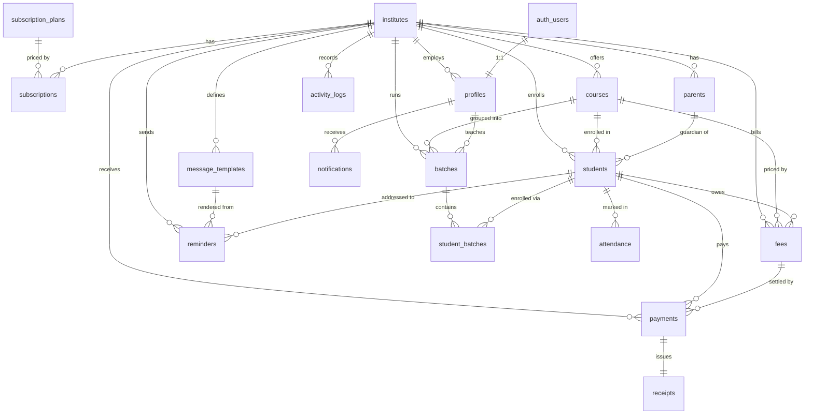

# EduFlow — Database Design & ER Diagram

PostgreSQL (Supabase). UUID PKs (`gen_random_uuid()`), FKs with explicit
`on delete` behaviour, audit columns on all business tables
(`created_at`, `updated_at`, `created_by`, `updated_by`), and per-tenant indexes.

## ER Diagram

## Tables (summary)

| Table                | Purpose                                            | Tenant col |
|----------------------|----------------------------------------------------|-----------|
| `subscription_plans` | Global pricing tiers (Starter/Growth/Professional) | — (global)|
| `institutes`         | **Tenant root** — institute profile                | `id`      |
| `subscriptions`      | Active plan + billing window per institute          | `institute_id` |
| `profiles`           | 1:1 with `auth.users`; holds tenant + role         | `institute_id` |
| `courses`            | Course catalogue + fee defaults                    | `institute_id` |
| `batches`            | Scheduled groups (timing, days, teacher)           | `institute_id` |
| `parents`            | Guardian records (+ optional portal user)          | `institute_id` |
| `students`           | Admissions; `student_code` unique per tenant       | `institute_id` |
| `student_batches`    | M:N student↔batch enrolment                         | `institute_id` |
| `attendance`         | Daily presence (Phase 2 UI)                        | `institute_id` |
| `fees`               | Billable charges; `status` derived from paid amt   | `institute_id` |
| `payments`           | Transactions (Razorpay/cash/…)                     | `institute_id` |
| `receipts`           | PDF receipts; number unique per tenant             | `institute_id` |
| `message_templates`  | Reusable WhatsApp/email bodies with `{{vars}}`     | `institute_id` |
| `reminders`          | Queued/sent message instances + delivery status    | `institute_id` |
| `notifications`      | In-app notifications per user                       | `institute_id` |
| `activity_logs`      | Append-only audit trail                            | `institute_id` |

## Money & dates

- **All amounts are stored as integer paise** (₹499 → `49900`) to avoid float
  rounding. UI converts with `toPaise`/`toRupees`/`formatCurrency`.
- Dates are `date`; timestamps are `timestamptz` (UTC). Each institute carries a
  `timezone` (default `Asia/Kolkata`) for display/scheduling.

## Derived state

- `fees.status` is recomputed by `recompute_fee_status(fee_id)` from
  `amount`, `discount`, `amount_paid`, and `due_date`
  (`paid` / `partial` / `overdue` / `pending`).
- `increment_fee_payment(fee_id, amount)` adds a payment atomically and
  recomputes status — called from the Razorpay webhook.

## Migrations

| File | Contents |
|------|----------|
| `0001_init_extensions_enums.sql` | extensions (`pgcrypto`, `citext`, `pg_trgm`), enums |
| `0002_core_tables.sql`           | all tables, FKs, constraints, audit columns |
| `0003_indexes_triggers.sql`      | indexes, `updated_at` triggers, auth helpers, new-user trigger |
| `0004_rls_policies.sql`          | RLS enable + policies for every table |
| `0005_storage_buckets.sql`       | buckets + storage object policies |
| `0006_rpc_functions.sql`         | `increment_fee_payment`, `next_receipt_number` |
| `seed.sql`                       | plans + demo tenant/courses/batches/students/templates |
